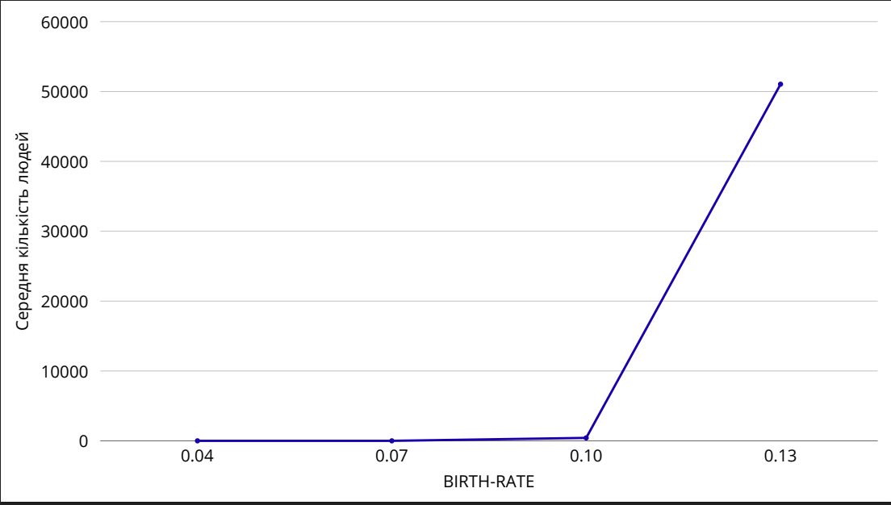
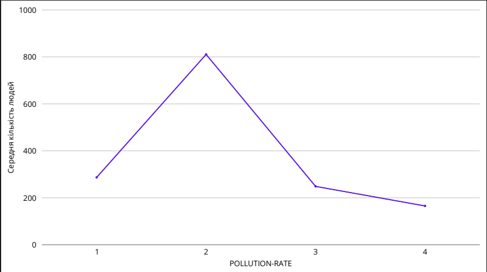
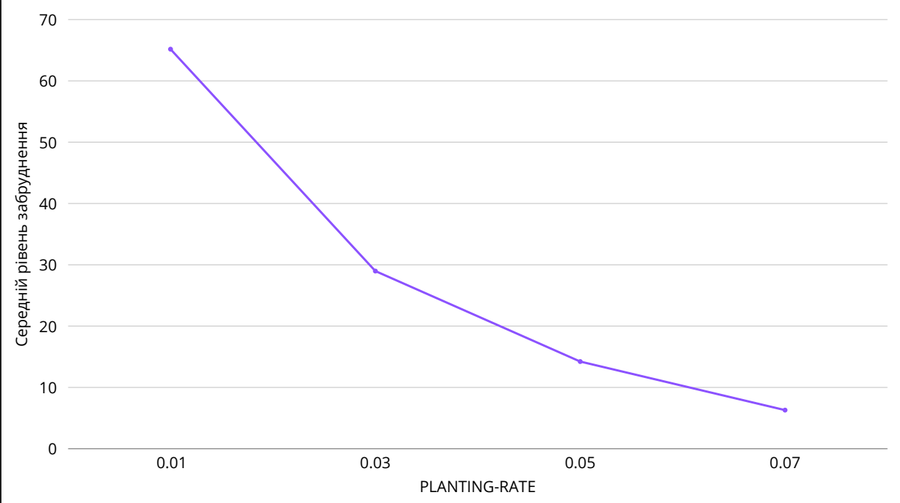

# Комп'ютерні системи імітаційного моделювання
## Лабораторна робота №1. Опис імітаційних моделей та проведення обчислювальних експериментів

# СПм-24-3 Семитоцький Давид Олегович
 

Модель [Urban Suite - Pollution](http://www.netlogoweb.org/launch#http://www.netlogoweb.org/assets/modelslib/Curricular%20Models/Urban%20Suite/Urban%20Suite%20-%20Pollution.nlogo)
 

### 1.1 Мета роботи
Ознайомитись з готовими моделями з різних предметних областей реального світу, які пропонуються середовищем мультиагентного імітаційного моделювання NetLogo.  
Навчитися описувати модель та проводити обчислювальні експерименти для дослідження її роботи.
 

# Вербальний опис моделі
Ця модель досліджує взаємодію між трьома ключовими компонентами замкненої екосистеми: людьми, деревами та забруднювачами, що поводяться як хижі агенти. Модель демонструє, як забруднення впливає на виживання та відтворення людей, а також як дії людей можуть пом’якшувати рівень забруднення через висадку дерев.

Система вважається стабільною, якщо чисельність населення людей, кількість дерев та рівень забруднення коливаються, але зберігаються в межах, які дозволяють екосистемі існувати тривалий час. Якщо ж коливання стають нерегулярними або надто різкими, одна або кілька популяцій можуть повністю зникнути, що свідчить про нестабільність системи.

У моделі передбачається, що електростанції постійно генерують забруднення, яке поширюється по всій території. Люди, перебуваючи в зоні високого забруднення, втрачають здоров’я і рідше відтворюються. Дерева, навпаки, очищують навколишнє середовище, але не здатні розмножуватися та мають обмежений термін життя. Таким чином, люди одночасно є «жертвами» забруднення та «стимуляторами» очищення довкілля.

Модель дозволяє спостерігати, як народжуваність, кількість електростанцій та швидкість забруднення впливають на довговічність популяції людей. Залежно від параметрів, екосистема може або досягати тимчасової рівноваги, або швидко руйнуватися, демонструючи складну природу взаємозалежностей у системі «люди — довкілля — забруднення».

# Керуючі параметри
До керуючи парметрів можно віднести наступні
- INITIAL-POPULATION визначає початкову кількість людей у моделі;
- BIRTH-RATE ймовірність того, що людина народить дитину за один такт моделі. Людина може відтворюватися лише тоді, коли її рівень здоров’я ≥ 4;
- PLANTING-RATE ймовірність того, що людина посадить дерево під час одного такту. Дерева живуть 50 років і не відтворюються;
- POWER-PLANTS кількість електростанцій, які створюються на початку моделювання;
- POLLUTION-RATE швидкість генерації забруднення кожною електростанцією.

# Внутрішні параметри
До внутрішніх парметрів можна віднести наступне 
- health - внутрішній стан кожного агента (і людини, і дерева). У людей цей параметр зменшується на кожному кроці через старіння та вплив забруднення; якщо рівень здоров’я падає до 0, агент помирає. У дерев здоров’я також зменшується щокроку під час очищення забруднення;
- pollution - значення забруднення для кожної клітинки. Воно змінюється щокроку завдяки дифузії, забрудненню від електростанцій та очищенню деревами. Високе значення pollution негативно впливає на здоров’я людей; 
- is-power-plant? - внутрішній логічний параметр клітинки, який визначає, чи є вона електростанцією. Від цього залежить, чи генерується в ній фіксований обсяг забруднення;
- pcolor - внутрішній технічний параметр клітинок, який відповідає за візуальне відображення рівня забруднення та дерев, але не впливає на поведінку моделі;
- кількість агентів (людей та дерев) - внутрішні показники, що відображають поточну чисельність людей та дерев на кожному кроці симуляції. Ці значення не задаються користувачем, але постійно змінюються внаслідок народжуваності, смертності та посадки дерев.

# Показники системи
Система має три основні показники роботи, а саме: кількість людей, кількість дерев та загальний рівень забруднення. Ці три параметри відображають поточний стан екосистеми та безпосередньо впливають один на одного.

# Недоліки системи
До недоліків моделі можна віднести кілька моментів, таких як:
- не враховується різний вплив типів забруднення на людей;
- немає взаємодії між людьми, наприклад конкуренції за ресурси; 
- очищення середовища деревами спрощене і не враховує реального росту дерев;
- не враховані зовнішні фактори, як погода чи сезонні зміни, які могли б впливати на поширення забруднення.

# Експеримент 1. Вплив BIRTH-RATE на чисельність людей
Метою цього експерименту було визначити, як зміна народжуваності впливає на динаміку популяції людей. Початкові умови включали початкову чисельність людей 30, дві електростанції, швидкість забруднення 3 та ймовірність посадки дерев 0.05.

Всі дослідження триватимуть 200 кроків, за умови, що симуляція не закінчиться раніше. Також кожне дослідження буде проведено 3 рази, а для подальшого аналізу результатів буде використане середнє значення. Це допоможе побачити більш глибоку картину того, що відбувається.

**Результати експериментів**

| Номер експерименту | BIRTH-RATE | Кінцева кількість людей | Кінцевий рівень забруднення | Кінцева кількість дерев |
| :---: | :---: | :---: | :---: | :---: |
| 1 | 0.04 | 0 | 86.03 | 101 |
| 2 | 0.04 | 0 | 86.09 | 96 |
| 3 | 0.04 | 0 | 58.31 | 67 |
| 4 | 0.07 | 0 | 70.14 | 85 |
| 5 | 0.07 | 0 | 90.81 | 68 |
| 6 | 0.07 | 0 | 129.96 | 60 |
| 7 | 0.10 | 401 | 5.53 | 1083 |
| 8 | 0.10 | 69 | 25.81 | 323 |
| 9 | 0.10 | 791 | 3.5 | 1718 |
| 10 | 0.13 | 52731| 0 | 46416|
| 11 | 0.13 | 56665 | 0 | 51568 |
| 12 | 0.13 | 43745 | 0 | 39007 |

Як видно з перших шести рядків, при низьких значеннях BIRTH-RATE = 0.02 та 0.05 у всіх прогонах модель приходить до стану, коли населення повністю зникає (кінцева кількість людей дорівнює нулю). При цьому рівень забруднення залишається досить високим (переважно в діапазоні від ~75 до 125 умовних одиниць), а кількість дерев хоч і не нульова, але відносно невелика. Це означає, що за низької народжуваності система не здатна підтримувати стійку популяцію людей: екосистема «переживає» людей, а забруднення не встигає суттєво зменшитися.

Для значення BIRTH-RATE = 0.10 ситуація змінюється. У рядках 7–9 кінцева кількість людей уже не нульова (від 65 до 83 осіб), а кількість дерев істотно зростає (від 151 до 340). У двох із трьох прогонів рівень забруднення наприкінці моделювання низький (3.5 та 19.75), лише в одному — ще досить високий. Отже, при такій народжуваності можливе формування відносно стійкої рівноваги: частина сценаріїв приводить до співіснування людей, дерев і невисокого забруднення.

Найбільш контрастні результати спостерігаються для BIRTH-RATE = 0.15 (рядки 10–12). Тут чисельність населення та кількість дерев зростають до сотень тисяч, а кінцевий рівень забруднення у всіх трьох прогонах дорівнює нулю. Такий сценарій відповідає вибуховому зростанню обох популяцій та повному «очищенню» середовища за рахунок гігантської кількості зелених насаджень, які повністю компенсують викиди.

# Експеримент 2. Вплив POLLUTION-RATE на стан екосистеми
Метою експерименту було оцінити, як інтенсивність забруднення впливає на здоров’я і чисельність людей. Початкові умови встановлювалися наступні: початкова чисельність людей 30, BIRTH-RATE 0.1, дві електростанції, ймовірність посадки дерев 0.05.

Всі дослідження триватимуть 200 кроків, за умови, що симуляція не закінчиться раніше. Також кожне дослідження буде проведено 3 рази, а для подальшого аналізу результатів буде використане середнє значення. Це допоможе побачити більш глибоку картину того, що відбувається.

**Результати експериментів**

| Номер експерименту | POLLUION-RATE | Кінцева кількість людей | Кінцевий рівень забруднення | Кінцева кількість дерев |
| :---: | :---: | :---: | :---: | :---: |
| 1 | 1 | 50 | 20.14 | 115 |
| 2 | 1 | 334 | 0 | 771 |
| 3 | 1 | 477 | 1.32 | 1173 |
| 4 | 2 | 1075 | 1.5 | 2754 |
| 5 | 2 | 712 | 0.5 | 1864 |
| 6 | 2 | 645 | 1.33 | 1687 |
| 7 | 3 | 396 | 3 | 1267 |
| 8 | 3 | 305 | 3.2 | 607 |
| 9 | 3 | 45 | 20.47 | 196 |
| 10 | 4 | 56 | 61.69 | 146 |
| 11 | 4 | 121 | 17.47 | 488 |
| 12 | 4 | 319 | 17.27 | 1055 |

Для найнижчого значення POLLUTION-RATE = 1 система загалом поводиться сприятливо: у двох з трьох запусків кінцевий рівень забруднення практично нульовий, а кількість дерев сягає сотень і навіть понад тисячу. Чисельність населення також досить велика (до 477 осіб). Лише в одному прогоні забруднення залишається помітним (20.14), а кількість людей — невеликою (50), що демонструє випадковий характер моделі, але в середньому екосистема при такому значенні параметра є здоровою.

При POLLUTION-RATE = 2 спостерігається ще більш виражений «зелений» сценарій. Кінцева кількість дерев у всіх прогонах дуже велика (від ~1687 до 2754), населення теж численне (від 645 до 1075 людей), а рівень забруднення наближається до нуля. Таким чином, помірні значення інтенсивності забруднення разом з іншими налаштуваннями моделі приводять до стійкого співіснування людей і природи при мінімальному рівні забруднення.

Для POLLUTION-RATE = 3 ситуація поступово погіршується. У перших двох прогонах ще зберігається помірний рівень забруднення (3–3.2) та відносно велика кількість дерев і людей, але вже в третьому випадку кінцеве забруднення різко зростає до 20.47, а дерева й населення різко скорочуються (196 дерев, 45 людей). Це свідчить про те, що при збільшенні швидкості забруднення система стає менш стабільною: з’являються сценарії, в яких довкілля починає деградувати.

Нарешті, при POLLUTION-RATE = 4 спостерігаються найгірші показники. У всіх трьох прогонах рівень забруднення наприкінці моделювання залишається високим (понад 17, а в одному випадку — понад 60), кількість дерев помітно зменшується, а населення суттєво нижче, ніж при менших значеннях параметра. Це означає, що надмірно висока інтенсивність забруднення руйнує екосистему: дерево­ва рослинність не встигає компенсувати викиди, а люди втрачають сприятливе середовище для життя.

# Експеримент 3. Вплив PLANTING-RATE на рівень забруднення
Мета експерименту полягала в демонстрації того, як частота посадки дерев впливає на забруднення та стан популяції людей. Початкові умови: 30 людей на старті, BIRTH-RATE 0.1, 2 електростанції, POLLUTION-RATE 3.

Всі дослідження триватимуть 200 кроків, за умови, що симуляція не закінчиться раніше. Також кожне дослідження буде проведено 3 рази, а для подальшого аналізу результатів буде використане середнє значення. Це допоможе побачити більш глибоку картину того, що відбувається.

**Результати експериментів**

| Номер експерименту | PLANTING-RATE | Кінцева кількість людей | Кінцевий рівень забруднення | Кінцева кількість дерев |
| :---: | :---: | :---: | :---: | :---: |
| 1 | 0.01 | 837 | 21.28 | 376 |
| 2 | 0.01 | 44 | 108.16 | 24 |
| 3 | 0.01 | 318 | 66.06 | 171 |
| 4 | 0.03 | 50 | 46.34 | 117 |
| 5 | 0.03 | 364 | 11.01 | 654 |
| 6 | 0.03 | 58 | 29.6 | 186 |
| 7 | 0.05 | 341 | 8.94 | 773 |
| 8 | 0.05 | 52 | 30.53 | 231 |
| 9 | 0.05 | 489 | 3.18 | 1082 |
| 10 | 0.07 | 62 | 11.21 | 242 |
| 11 | 0.07 | 36 | 5.2 | 340 |
| 12 | 0.07 | 565 | 2.5 | 2020 |

За найнижчого значення PLANTING-RATE = 0.01 результати сильно коливаються. У першому прогоні спостерігається досить велика кількість людей (837) і дерев (376), але при цьому рівень забруднення залишається помітним (21.28). У другому запуску забруднення зростає до 108.16, дерева майже повністю зникають (24), а населення різко скорочується до 44 осіб. Третій прогін дає проміжний результат із високим забрудненням (66.06) та невеликою кількістю дерев. У середньому можна сказати, що при низькій швидкості висаджування дерев екосистема нестійка: іноді система ще утримується, але часто забруднення «перемагає».

Для PLANTING-RATE = 0.03 ситуація дещо покращується. У деяких прогонах кількість дерев суттєво зростає (654), забруднення помітно зменшується (11.01), а чисельність населення стає досить великою (364 людей). В інших запусках ще зберігаються сценарії з підвищеним забрудненням і меншим числом дерев, але в цілому видно, що збільшення швидкості висаджування дерев допомагає частково стабілізувати систему.

Найкращі усереднені результати дають значення PLANTING-RATE = 0.05. Тут в окремих прогонах кінцевий рівень забруднення стає дуже низьким (3.18–8.94), а кількість дерев зростає до 773–1082. Населення в таких сценаріях також відносно велике (341–489 людей). Лише один запуск показує трохи вищий рівень забруднення, але навіть там ситуація помітно краща, ніж при меншому PLANTING-RATE.

Для найбільшого розглянутого значення PLANTING-RATE = 0.07 тенденція до покращення продовжується. Забруднення в усіх трьох прогонах залишається невеликим (2.5–11.21), а кількість дерев може досягати дуже великих значень (до 2020 дерев). Чисельність населення теж у деяких сценаріях значна (наприклад, 565 людей в експерименті 12). Отже, чим більша швидкість висаджування дерев, тим ефективніше модель «очищує» довкілля та тим більша ймовірність, що в системі одночасно збережуться і люди, і зелена інфраструктура при низькому рівні забруднення.

# Висновок
Під час даної лабороторної роботи були ознайомлені з готовими моделями з різних предметних областей реального світу, які пропонуються середовищем мультиагентного імітаційного моделювання NetLogo. Навчитилися описувати модель та проводити обчислювальні експерименти для дослідження її роботи.
