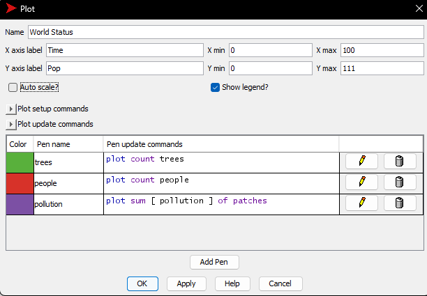
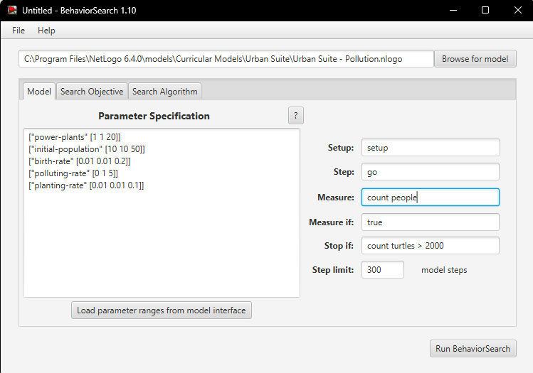
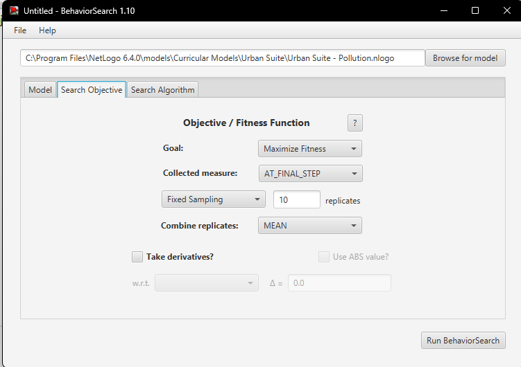
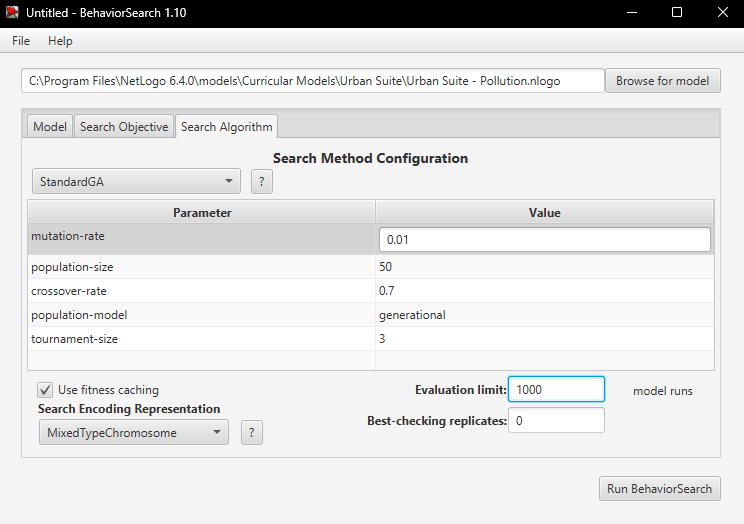
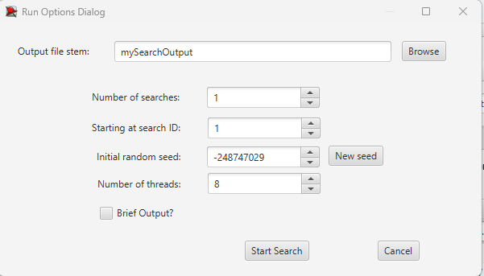
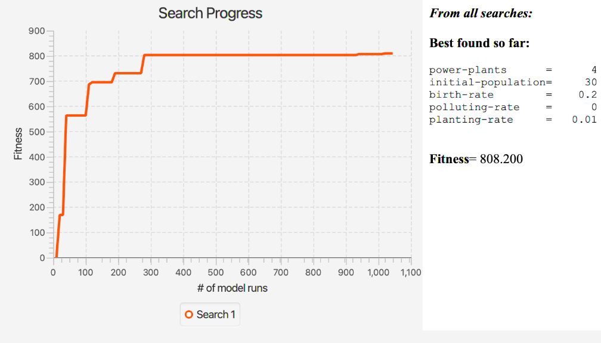
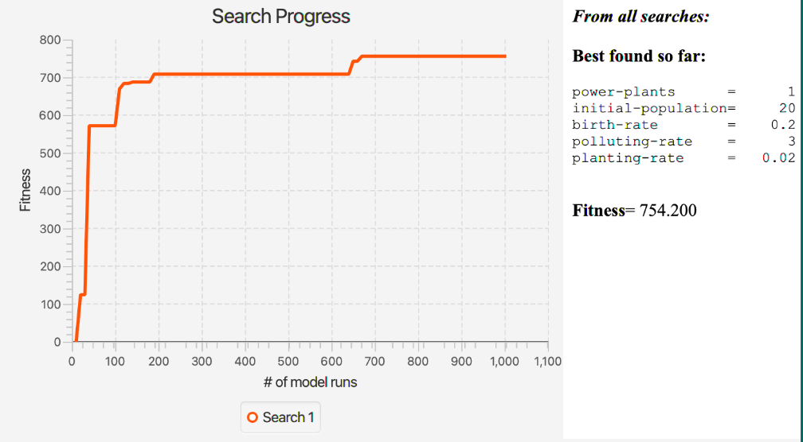
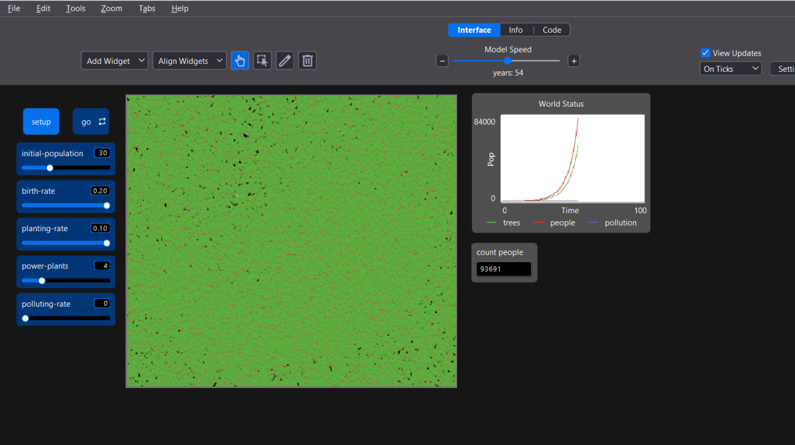
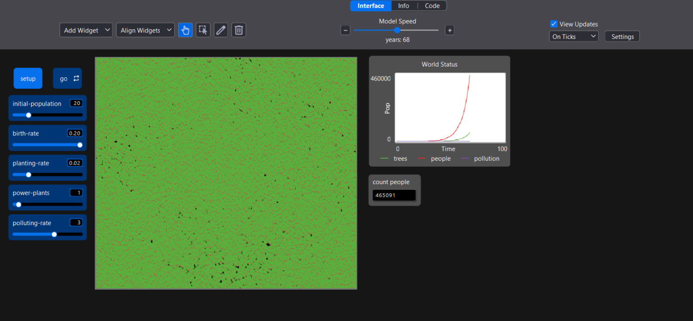

## Комп'ютерні системи імітаційного моделювання
## СПм-24-3, Семитоцький Давид Олегович
### Лабораторна робота №**3**. Використання засобів обчислювального інтелекту для оптимізації імітаційних моделей

 

### Варіант 4, модель у середовищі NetLogo:
[Urban Suite - Pollution](http://www.netlogoweb.org/launch#http://www.netlogoweb.org/assets/modelslib/Curricular%20Models/Urban%20Suite/Urban%20Suite%20-%20Pollution.nlogo)

 

### Керуючі параметри:
- **initial-population** Початкова кількість населення у місті: контролює кількість людей, створених на початку запуску моделі.
- **birth-rate** Швидкість приросту населення міста: контролює ймовірність кожної людини створити потомство протягом певного періоду.
- **planting-rate** Швидкість посадки дерев для зменшення забруднення: контролює ймовірність, що людина буде садити дерево щорічно.
- **power-plants** Початкова кількість електростанцій у місті: контролює кількість електростанцій, створених на початку запуску моделі.
- **polluting-rate** Забруднення, яке виділяє кожна електростанція за рік: поширюється на навколишню територію і визначає його вплив на здоров'я людей

### Показники роботи системи:
- **Динаміка висадження дерев** Оцінка кількості нових дерев, які були посаджені, відображаючи зусилля у напрямку покращення екосистеми.
- **Зміни в чисельності населення** Визначення тенденцій у розмірі населення, що дозволяє відслідковувати вплив інших факторів на динаміку населення міста.
- **Рівень забруднення** Оцінка впливу електростанцій на рівень забруднення повітря, спрощуючи аналіз його впливу на навколишнє середовище.

 

### Налаштування середовища BehaviorSearch:

**Обрана модель**:
<pre>
C:\Program Files\NetLogo 6.4.0\models\Curricular Models\Urban Suite\Urban Suite - Pollution.nlogo
</pre>
**Параметри моделі** (вкладка Model):
<pre>
["power-plants" [1 1 20]]
["initial-population" [10 10 50]]
["birth-rate" [0.01 0.01 0.2]]
["polluting-rate" [0 1 5]]
["planting-rate" [0.01 0.01 0.1]]
</pre>
Використовувана **міра**:
Для фітнес-функції було обрано **кількість людей**, вираз для її розрахунку взято з налаштувань графіка аналізованої імітаційної моделі в середовищі NetLogo
та вказано у параметрі "**Measure**": 

  
<pre>
count people 
</pre>
Під час симуляції враховується **count people** (кількість людей) і вплив різних факторів, таких як народжуваність, забруднення від роботи електростанцій та посадка дерев, на зміну цього показника у кожен такт часу. Пошук проводиться протягом з обмеженням у 300 тактів роботи моделі (років) починаючи з 0 такту симуляції.
*Параметр "**Mesure if**" зі значення true, по суті, і означає, що враховуватимуться всі такти симуляції, а чи не частина їх.
Параметри "**Setup**" та "**Go**" вказують відповідні процедури ініціалізації та запуску в логіці моделі (зазвичай вони так і називаються). BehaviorSearch в процесі роботи, по суті, замість користувача запускає ці процедури.*  
"**Stop if**" налаштований так, щоб при досягненні популяції у 2000 осіб пошук автоматично припинявся.  
Загальний вигляд вкладки налаштувань параметрів моделі:  

**Налаштування цільової функції** (вкладка Search Objective):  
Метою підбору параметрів імітаційної моделі, що описує динаміку популяції людей враховуючи певні чинники реального світу, є максимізація значення кількості людей - це вказано через параметр "Goal" зі значенням Maximize Fitness. Тобто необхідно визначити такі параметри налаштувань моделі, у яких людство досягне максимально можливої популяції під кінець симуляції (тривалість якої (300 кроків) вказувалася на минулій вкладці). Для цього у параметрі "Collected measure", що визначає спосіб обліку значень обраного показника, вказано AT_FINAL_STEP. 
Щоб уникнути викривлення результатів через випадкові значення, що використовуються в логіці самої імітаційної моделі, кожна симуляція повторюється по 10 разів, результуюче значення розраховується як середнє арифметичне.  
Загальний вигляд вкладки налаштувань цільової функції:  

**Налаштування алгоритму пошуку** (вкладка Search Algorithm):  
*На цьому етапі було визначено модель, налаштовано її параметри (тобто вказано, які з них незмінні, а які в процесі пошуку можуть змінюватися і в яких діапазонах), і обрано міру, що лежить в основі функції пристосованості, що дозволяє оцінити якість кожного перевіряємого BehaviorSearch варіантів рішення.  
У ході дослідження на лабораторній роботі використовуються два алгоритми: Випадковий пошук(**RandomSearch**) і Простий генетичний алгоритм (**StandardGA**).  
Для цих алгоритмів, що вирішують завдання пошуку такого набору параметрів імітаційної моделі, щоб задовольнити вимоги користувача (у нашому випадку – максимізувати значення кількості людей - агентів у заданій імітаційній моделі), вказуємо що "Evaluation limit" (число ітерацій пошуку, у разі ГА – це буде кількість поколінь), та "Search Space Encoding Representation" (спосіб кодування варіанта вирішення). Параметр "Use fitness caching" впливає лише на продуктивність. Параметри, специфічні для генетичного алгоритму, використовуємо за замовчанням.*  
Загальний вид вкладки налаштувань алгоритму пошуку:  

 

### Результати використання BehaviorSearch:
Діалогове вікно запуску пошуку:  
 
Результат пошуку параметрів імітаційної моделі, використовуючи **генетичний алгоритм**:  
 
Результат пошуку параметрів імітаційної моделі, використовуючи **випадковий пошук**:  

 
Генетичний алгоритм: Графік показує класичну криву збіжності для ГА. Дуже стрімке зростання на перших 50 прогонах (еволюція відсіює слабкі рішення). Після досягнення рівня ~800 настає фаза "експлуатації" (стабілізації), де алгоритм лише незначно покращує результат.
 
 
Випадковий пошук: Графік має вигляд "сходинок". Алгоритм тикає пальцем у небо: довгий час немає покращень, потім випадково знаходиться краща комбінація (стрибок на ~40-му, ~120-му та ~630-му прогонах). Він так і не зміг випадково натрапити на комбінацію polluting-rate = 0 + birth-rate = 0.2, зупинившись на локальному оптимумі.
 
 

### Результати у NetLogo:

Імітаційна модель при значеннях параметрів, які були отримані в результаті **генетичного алгоритму**:  
  

Імітаційна модель при значеннях параметрів, які були отримані в результаті **випадкового пошуку**: 

 
Висновок
У цьому експерименті Генетичний алгоритм показав себе значно краще. Він не просто перебирав варіанти, а зміг еволюціонувати до логічного висновку: щоб максимізувати населення, потрібно прибрати смертність від забруднення до нуля, навіть якщо це вимагає точного влучання в параметр polluting-rate = 0. Випадковий пошук знайшов компромісне, але менш ефективне рішення (мало станцій, але вони токсичні).
